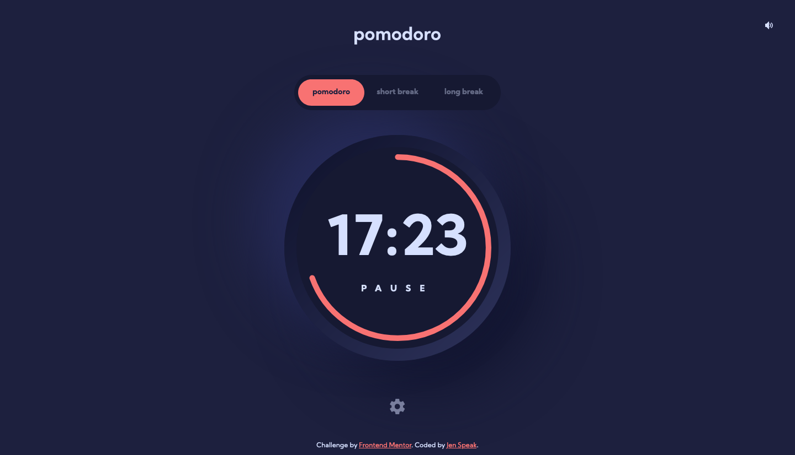

# Pomodoro Timer

This is a solution to the [Pomodoro app challenge on Frontend Mentor](https://www.frontendmentor.io/challenges/pomodoro-app-KBFnycJ6G). Frontend Mentor challenges help you improve your coding skills by building realistic projects.

## Table of contents

-   [Overview](#overview)
    -   [The challenge](#the-challenge)
    -   [Screenshots](#screenshots)
    -   [Links](#links)
-   [My process](#my-process)
    -   [Built with](#built-with)
    -   [What I learned](#what-i-learned)
    -   [Continued development](#continued-development)
    -   [Useful resources](#useful-resources)
-   [Author](#author)

## Overview

### The challenge

Users should be able to:

-   Set a pomodoro timer and short & long break timers
-   Customize how long each timer runs for
-   See a circular progress bar that updates every minute and represents how far through their timer they are
-   Customize the appearance of the app with the ability to set preferences for colors and fonts

### Screenshots

### Links

-   [Solution URL](https://your-solution-url.com)
-   [Live Site URL](https://pomodoro-timer-mu-seven.vercel.app/)

## My process

### Built with

-   Semantic HTML5 markup
-   CSS custom properties
-   Flexbox
-   CSS Grid
-   Mobile-first workflow
-   [React](https://reactjs.org/) - JS library
-   [Redux Toolkit](https://redux-toolkit.js.org/) - For state management
-   [Styled Components](https://styled-components.com/) - For styles
-   [Reach UI](https://reach.tech/) - Accessible React component library. Used the Dialog (Modal) component
-   [useSound Hook](https://github.com/joshwcomeau/use-sound) - React hook for playing sound effects
-   [React Circular Progressbar](https://github.com/kevinsqi/react-circular-progressbar) - React library for a circular progressbar component

### What I learned

1. My major focus for this project was to use Redux for state management. First I wanted to make sure I could get all the functionality of the app working with just using the useState hook for state which worked, but I had to do a lot of prop drilling because it turned out that there was a lot of state that needed to be shared between different components and some of those components were deeply nested (you can check out this version of the app in the [no-redux](https://github.com/En-Jen/pomodoro-timer/tree/no-redux) branch of this repo). I quickly saw how the maintainability of the app was suffering, so I opted for refactoring the app to use [Redux](https://redux.js.org/), [React Redux](https://react-redux.js.org/), and [Redux Toolkit](https://redux-toolkit.js.org/). I had previously shied away from using Redux because of all the boilerplate it requires, but I was pleased to find that Redux Toolkit really cut down on the amount of boilerplate needed. It's also really nice that you can write code that mutates the state inside the case reducers passed to `createSlice()`.

2. This was my first project where I got a chance to implement sound in the App. The useSound Hook makes it surprisingly easy, but you are required to find your own sound files which required a bit of digging around for usable sounds on [freesound](https://freesound.org/). After I selected the sounds I wanted to use, I edited them in [Audacity](https://www.audacityteam.org/) and then imported them into the project.

### Continued development

1. I'd like to continue learning how to use Redux and may try to use it without the [Redux Toolkit](https://redux-toolkit.js.org/) in my next project so that I feel more comfortable using it with the extra boilerplate that's needed when you don't use the Toolkit.

### Useful resources

-   [useSound Blog post](https://www.joshwcomeau.com/react/announcing-use-sound-react-hook/) - This blog post by Josh W Comeau is a nice intro to how to use sound on the web including how to find and prepare sounds and examples of how to use them.
-   [codecademy's Redux course](https://www.codecademy.com/learn/paths/front-end-engineer-career-path) - This is a resource that requires a pro account on codecademy.com, but if you have access to it or are willing to pay for it, this is the most helpful resource I've come across for learning Redux.

## Author

-   Frontend Mentor - [@En-Jen](https://www.frontendmentor.io/profile/En-Jen)
