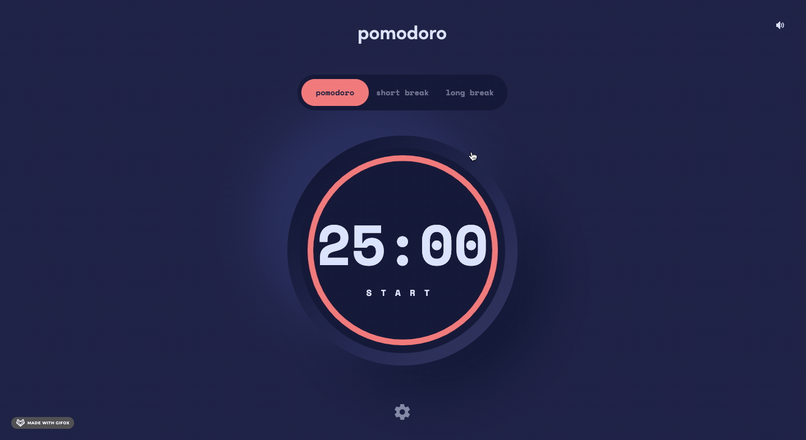

# Pomodoro Timer

This is a solution to the [Pomodoro app challenge on Frontend Mentor](https://www.frontendmentor.io/challenges/pomodoro-app-KBFnycJ6G). Frontend Mentor challenges help you improve your coding skills by building realistic projects.

## Table of contents

-   [Overview](#overview)
    -   [The challenge](#the-challenge)
    -   [Screenshots](#screenshots)
    -   [Links](#links)
-   [My process](#my-process)
    -   [Built with](#built-with)
    -   [What I learned](#what-i-learned)
    -   [Continued development](#continued-development)
    -   [Useful resources](#useful-resources)
-   [Author](#author)

## Overview

### The challenge

Users should be able to:

-   Set a pomodoro timer and short & long break timers
-   Customize how long each timer runs for
-   See a circular progress bar that updates every minute and represents how far through their timer they are
-   Customize the appearance of the app with the ability to set preferences for colors and fonts

### Screenshots




### Links

-   Solution URL: [Add solution URL here](https://your-solution-url.com)
-   Live Site URL: [Add live site URL here](https://your-live-site-url.com)

## My process

### Built with

-   Semantic HTML5 markup
-   CSS custom properties
-   Flexbox
-   CSS Grid
-   Mobile-first workflow
-   [React](https://reactjs.org/) - JS library
-   [Styled Components](https://styled-components.com/) - For styles
-   [Reach UI](https://reach.tech/) - Accessible React component library. Used the Dialog (Modal) component
-   [useSound Hook](https://github.com/joshwcomeau/use-sound) - React hook for playing sound effects
-   [React Circular Progressbar](https://github.com/kevinsqi/react-circular-progressbar) - React library for a circular progressbar component

### What I learned

Use this section to recap over some of your major learnings while working through this project. Writing these out and providing code samples of areas you want to highlight is a great way to reinforce your own knowledge.

To see how you can add code snippets, see below:

```html
<h1>Some HTML code I'm proud of</h1>
```

```css
.proud-of-this-css {
	color: papayawhip;
}
```

```js
const proudOfThisFunc = () => {
	console.log('🎉');
};
```

### Continued development

Use this section to outline areas that you want to continue focusing on in future projects. These could be concepts you're still not completely comfortable with or techniques you found useful that you want to refine and perfect.

### Useful resources

-   [Example resource 1](https://www.example.com) - This helped me for XYZ reason. I really liked this pattern and will use it going forward.
-   [Example resource 2](https://www.example.com) - This is an amazing article which helped me finally understand XYZ. I'd recommend it to anyone still learning this concept.

## Author

-   Frontend Mentor - [@En-Jen](https://www.frontendmentor.io/profile/En-Jen)
